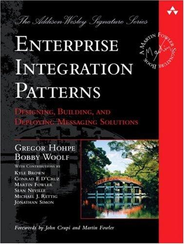
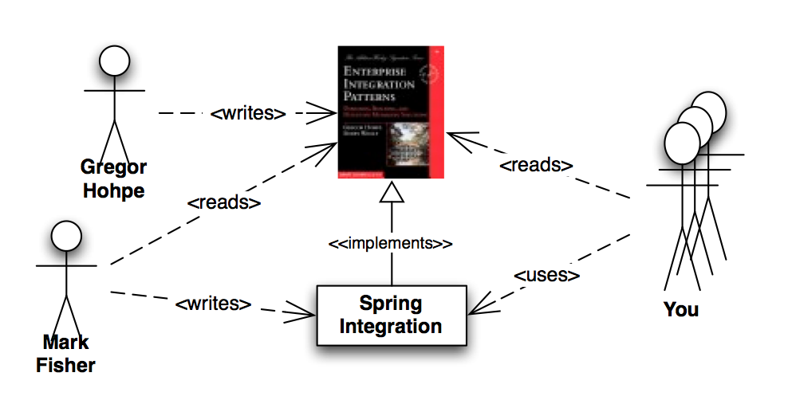

!SLIDE

# Case Study #

<!--
* Spring Integration
* http://static.springsource.org/spring-integration/reference/htmlsingle/#new-infrastructure
-->

!SLIDE subsection

# Spring Integration

!SLIDE center

# (brief intro) #

!SLIDE center

!SLIDE

# It's all about

!SLIDE

# Messages

!SLIDE

# Channels

!SLIDE

# Endpoints

!SLIDE 

# And the patterns they form

!SLIDE center

!SLIDE center

!SLIDE bullets incremental

# Spring Integration #

* 22 sub-projects
* 2.0 GA released on Nov 22nd 2010
* 

