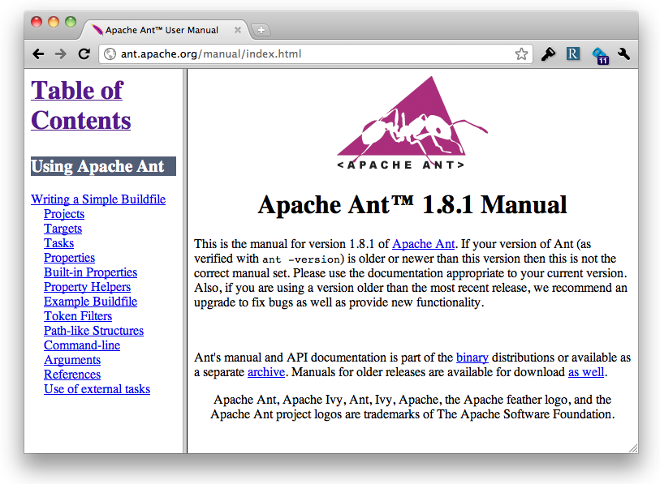
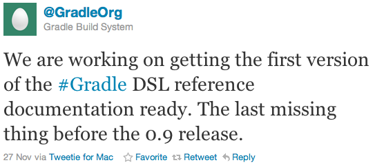
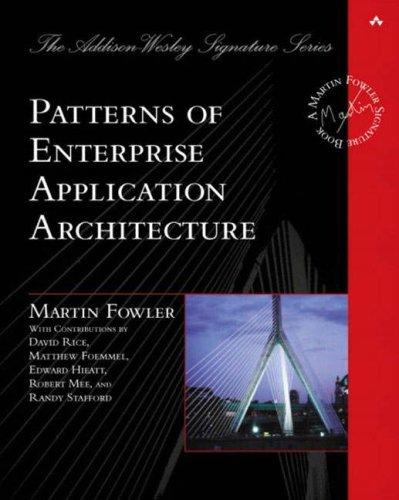

!SLIDE transition=scrollDown

# What Gradle needs

!SLIDE subsection

# DSL documentation

!SLIDE center

# The most important move Ant ever made

!SLIDE center

!SLIDE incremental bullets

# DSL doc vs User Guide
* Gradle's got a great [User Guide](http://gradle.org/0.9-rc-3/docs/userguide/userguide_single.html)
* Explains concepts
* Walks through certain scenarios
* Very helpful when getting started

!SLIDE incremental bullets

# DSL doc vs API doc
* Gradle's got [JavaDoc](http://gradle.org/0.9-rc-3/docs/javadoc)
* Often useful
* But it's not enough
* DSL often relies on Groovy metaprogramming
* JavaDoc can't cover that

!SLIDE incremental bullets

# e.g.

    @@@ Groovy
    subprojects {
        // what properties are available?
    }

!SLIDE incremental bullets

# DSL doc

* Would be, well, *DSL-centric*
* Every day reference for build masters

!SLIDE center incremental bullets transition=scrollDown

# Good News

!SLIDE subsection

# Plugin Portal

!SLIDE full-page

!SLIDE subsection

# Test-Driven Builds

!SLIDE incremental bullets

# Test-Driven Builds

* For the same reasons we test other code
* Special challenges

!SLIDE subsection

# Tooling

!SLIDE incremental bullets

# Tooling

* Gradle UI is there
* IDEA integrates it
* Eclipse tooling is a must
* Bash-completion / Gradle shell
* Project quick-start (archetypes)

!SLIDE subsection

# Key Plugins

!SLIDE incremental bullets

# Key Plugins

* Docbook
* AspectJ
* ...

!SLIDE subsection

# Rich Deployment/Rollback

!SLIDE incremental bullets

# Rich Deployment/Rollback

* Building blocks are there
* Whole subdomain that needs modeling
* Look to [Capistrano](https://github.com/capistrano/capistrano) for inspiration

!SLIDE subsection

# Patterns

!SLIDE center

* 

!SLIDE incremental bullets

## Patterns of Enterprise Application Architecture

!SLIDE incremental bullets

## Patterns of Enterprise <strike>Application Architecture</strike>

!SLIDE incremental bullets

## Patterns of Enterprise Project Automation

!SLIDE incremental bullets

## Patterns of Enterprise Project Automation

* Level the playing field
* Provide common concepts
* Good for competition

!SLIDE incremental bullets

# Somebody please write this!
* (Hans, I'm looking at you)
